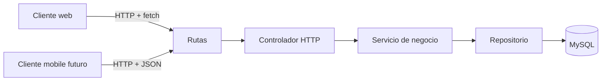

# Evolución profesional de SaludWEB

## De una aplicación tradicional a una arquitectura desacoplada

SaludWEB parte del sistema construido en Programación III y evoluciona hacia una arquitectura cliente-servidor moderna. La meta no es desechar lo que ya funciona, sino separar responsabilidades para que el sistema pueda explicarse, mantenerse y crecer.

## Situación de partida

En el modelo tradicional, PHP resolvía en el mismo flujo la petición HTTP, la consulta a MySQL y la generación del HTML. Ese enfoque es válido para una aplicación pequeña, pero mezcla presentación, negocio y persistencia. Como consecuencia:

- cambiar la interfaz puede afectar la lógica del sistema;
- cada navegación suele requerir una página completa nueva;
- reutilizar la lógica desde una aplicación móvil o un tercero resulta más difícil;
- frontend y backend comparten archivos y tienen menos independencia para trabajar.

## Arquitectura actual

El proyecto ya separa el backend en capas y expone una API REST para médicos:

- **Backend:** `repositorio_backend/` concentra rutas, controladores, servicios y persistencia.
- **Web:** `repositorio_web/` contiene las pantallas que presentan la experiencia del usuario.
- **Mobile:** `repositorio_mobile/` queda preparado como otro cliente posible.
- **API REST:** usa verbos HTTP y JSON para operar recursos, sin que el controlador tenga que conocer el diseño visual.

El proyecto principal mantiene una modalidad híbrida durante la transición: algunas páginas se renderizan con PHP y las operaciones de médicos se realizan mediante `fetch` contra la API. Esta decisión permite migrar por etapas y conservar la funcionalidad existente.

## Contrato actual de la API

| Método | Endpoint | Propósito | Respuesta principal |
|---|---|---|---|
| `GET` | `/api/medicos` | Listar médicos | `200` + arreglo JSON |
| `GET` | `/api/medicos/{id}` | Consultar un médico | `200` + objeto JSON o `404` |
| `POST` | `/api/medicos` | Crear un médico | `201` + objeto creado |
| `PUT` / `PATCH` | `/api/medicos/{id}` | Actualizar datos o estado | `200` + objeto actualizado |
| `DELETE` | `/api/medicos/{id}` | Eliminar un médico | `200` o `404` |
| `DELETE` | `/api/prescripciones/{id}` | Eliminar una receta | `200` o `404` |

Los datos de entrada se envían como JSON. Las respuestas exitosas y los errores usan `Content-Type: application/json` y códigos HTTP que permiten al cliente distinguir cada situación.

## Responsabilidades y decisiones

### Backend: motor de negocio

- **Router:** relaciona método y URL con un controlador.
- **Controller:** interpreta la petición y construye la respuesta HTTP.
- **Service:** valida datos y aplica reglas de negocio.
- **Repository:** ejecuta consultas SQL preparadas mediante PDO.
- **Bootstrap:** inicializa dependencias y la conexión a la base de datos.

La inyección de dependencias (`Controller -> Service -> Repository -> PDO`) reduce el acoplamiento y facilita probar o reemplazar una capa sin modificar las demás.

### Frontend: experiencia del usuario

El cliente web usa JavaScript y `fetch` para consultar y modificar médicos. Recibe JSON, actualiza la interfaz y puede evitar recargas completas para acciones puntuales. La API no necesita saber si el cliente es una página web, una futura app móvil o una integración externa.

## Hoja de ruta de modernización

1. Mantener las páginas actuales funcionando mientras se estabiliza el contrato de la API.
2. Incorporar endpoints de prescripciones y mover sus consultas desde las vistas hacia el backend.
3. Hacer que el cliente web cargue sus datos mediante `fetch` y renderice la interfaz en el navegador.
4. Centralizar autenticación, autorización, validación de entrada y formato de errores.
5. Documentar cada endpoint, agregar pruebas por capa y separar despliegues de backend y frontend cuando el proyecto lo requiera.

## Relación con el TFI

Cada decisión debe poder defenderse técnicamente:

- **Separación de capas:** reduce el acoplamiento y facilita el mantenimiento.
- **API REST:** permite reutilizar la misma lógica desde web, mobile u otros clientes.
- **JSON:** ofrece un formato interoperable entre tecnologías.
- **Migración gradual:** disminuye el riesgo y conserva las funcionalidades que ya fueron validadas.
- **Documentación y pruebas:** hacen que el sistema sea explicable y verificable, no solo ejecutable.

El objetivo profesional ya no es únicamente que la aplicación funcione. También debe poder explicarse, mantenerse y defenderse.
