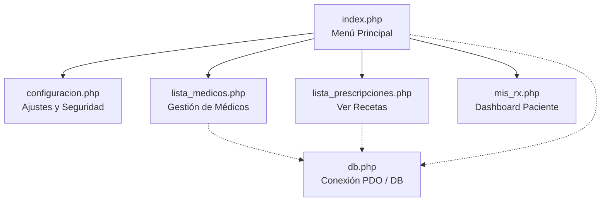

# Guía de Estudio: Organización de Módulos (SaludWeb)

Esta guía resume la estructura y funcionamiento del proyecto **SaludWeb - Organización de Módulos** para ayudarte a estudiar los conceptos clave de programación web en PHP, SQL, HTML, CSS y JavaScript.

---

## 🗺️ Mapa del Proyecto

El proyecto está organizado en varios módulos que interactúan entre sí y con una base de datos centralizada:

---

## 📁 Detalle de los Archivos y sus Conceptos Clave

### 1. `index.php` (Menú de Entrada)
* **Función:** Punto de entrada simple. Permite la navegación rápida entre los submódulos.
* **Concepto a estudiar:** **Modularización**. En lugar de tener un único archivo gigante, el proyecto se divide en submódulos especializados.

### 2. `configuracion.php` (Ajustes y UI)
* **Función:** Interfaz gráfica para que el usuario controle opciones de notificaciones, active autenticación de dos factores (2FA), o descargue sus datos.
* **Concepto a estudiar:** 
  * **Variables CSS (`:root`):** Permiten centralizar la paleta de colores para mantener la consistencia visual (`--primary`, `--bg`, `--text`).
  * **Diseño Responsivo (`@media`):** Adaptabilidad en pantallas de celulares o tabletas reorganizando los elementos del menú y las filas de ajustes.

### 3. `lista_medicos.php` (Gestión de Profesionales)
* **Función:** Permite ver y alternar el estado (Operativo/Inactivo) de los médicos de la base de datos.
* **Conceptos a estudiar:**
  * **Consultas de Selección (`SELECT * FROM medicos ORDER BY...`):** Trae los datos ordenando primero a los activos.
  * **Consumo de APIs asíncronas (`fetch` con `PATCH`):** En lugar de recargar toda la página al activar/desactivar un médico, JavaScript envía una petición PATCH en segundo plano a una API con el identificador del médico.

### 4. `lista_prescripciones.php` (Recetario Digital)
* **Función:** Permite listar, filtrar y eliminar recetas electrónicas.
* **Conceptos a estudiar:**
  * **Parámetros URL y Métodos HTTP (`GET`):** Al cambiar el selector de estado, el formulario se envía mediante GET y PHP lee el estado con `$_GET['estado']`.
  * **Consultas Relacionales (`LEFT JOIN`):** Cruza información de las tablas `prescripciones`, `pacientes` y `medicos` para obtener el nombre de las personas en vez de mostrar IDs numéricos.
  * **Manejo de Datos Complejos (JSON en PHP):** Las recetas guardan los medicamentos en formato JSON de texto. PHP usa `json_decode()` para convertir el texto en un array que luego recorre con un bucle `foreach`.
  * **Eliminación asíncrona (`fetch` con `DELETE`):** Envía una solicitud DELETE a la API y utiliza JavaScript para eliminar la fila HTML correspondiente (`document.getElementById('fila-' + id).remove()`) sin necesidad de recargar la página entera.

### 5. `mis_rx.php` (Dashboard de Paciente)
* **Función:** Centro de control visual estructurado con grillas para el acceso de pacientes.
* **Concepto a estudiar:** **Código Dinámico vs Estático**. Mientras que la estructura HTML es fija, el campo *"Última Sincronización"* se genera dinámicamente con código PHP del servidor en tiempo real: `<?php echo date('d/m/Y H:i'); ?>`.

---

## 💡 Conceptos Teóricos Esenciales para Exámenes

### A. ¿Qué es PDO (PHP Data Objects)?
Es una interfaz para acceder a bases de datos en PHP de forma segura y uniforme. 
* **Sentencias Preparadas (`prepare` y `execute`):** Se utilizan en `lista_prescripciones.php` para separar el código SQL de los datos enviados por el usuario. Esto evita ataques de **Inyección SQL**.

### B. ¿Cómo funciona la comunicación asíncrona (AJAX/Fetch)?
1. El usuario realiza una acción (ej. hace clic en "Eliminar").
2. JavaScript interviene y crea una petición asíncrona usando la función `fetch()`.
3. El servidor PHP procesa la petición en segundo plano y devuelve una respuesta (generalmente en formato **JSON**).
4. JavaScript lee la respuesta y actualiza el HTML de la página (ej. remueve la fila eliminada) sin alterar el resto de la pantalla.

### C. Relación de Base de Datos (del archivo `db.php`)
* **Tabla `pacientes`** se relaciona con **`obras_sociales`** (id_obra_social).
* **Tabla `prescripciones`** guarda relaciones de clave foránea (`FOREIGN KEY`) con **`pacientes`** y **`medicos`**.
* Si se elimina un paciente, la regla `ON DELETE CASCADE` borra automáticamente todas sus recetas asociadas para no dejar datos huérfanos.
